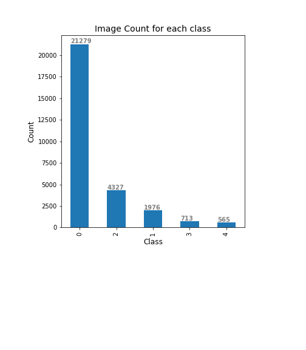
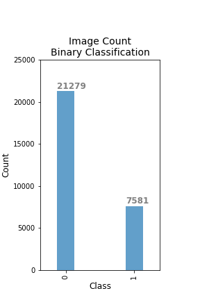
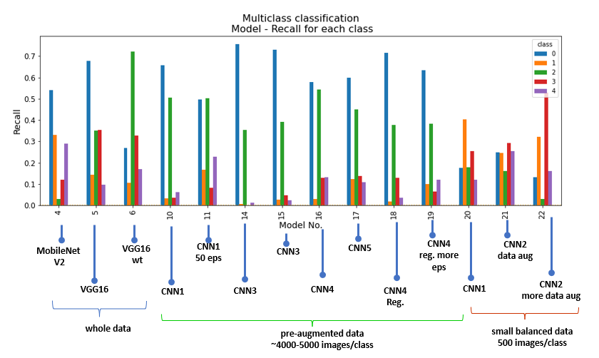

## Problem Statement

Diabetic Retinopathy (DR) is a complication resulting from diabetes that affects the eyes. It is caused by the damage of the blood vessels in the tissue at the back of the eye called retina. It can cause loss of vision or in severe cases can lead to blindness. Early detection of diabetic retinopathy is extremely crucial to prevent complete blindness. Currently DR is manually detected by trained clinians by examining the photographs of the retina and detecting the presence of lesions associated with the abnorminal blood vessels or haemorrage, that may represent as tiny red spots in the image. This manual detection is a very time consuming process. An automated system of DR detection from the images can help with early detection of this condition and help improve patients lives.

This project aims to create a model for automated detection (prediction) of the presence or absence of the condition by analyzing color fundus images, and if possible the severity of the condition. To address this task, different modeling techniques will be explored to find a model that can predict the presence of condition (Binary Classification). Since, this is a diagnostic problem, recall will be used as metrics to analyze the model performance and the goal would be to train a model to achieve as high recall as possible. Higher recall for positive class are prefereable even if there are more false positives since diagnosis of the condition is more important in this scenario.

We will also attempt to explore different modeling techniques to predict the presence along with severity of the condition (multi-class classification) and will use Recall as metrics. It is desirbale to have high recall for mild to moderate conditions since these might be easily missed by just manually analyzing the images and if the model can be trained to detect mild and modelrate conditions better, it may help alert the patient of the condition early on. 
  
References:  
1. https://www.mayoclinic.org/diseases-conditions/diabetic-retinopathy/symptoms-causes/syc-20371611  
2. https://www.kaggle.com/competitions/diabetic-retinopathy-detection/data
3. R, Revathy. (2020). Diabetic Retinopathy Detection using Machine Learning. International Journal of Engineering Research and. V9. 10.17577/IJERTV9IS060170.   

## Items in this Repo
1) "code" folder containing:

    - Data Pre-prpcessing notebook:
           
        - "01.1-Pre-Processing.ipynb" (webscraping for COVID surveillance data collection)
    
    - Model Tuning jupyter notebook:
     
        - "02.1-Model-Tuning-Multiclass-Classification.ipynb"
        - "02.2-Model-Tuning-Binary-Classification.ipynb" 

2) "images" folder containing analysis and modeling result images

  
## Data Collection

The data used in this project is a large set of retina images obtained from a Kaggle competition (https://www.kaggle.com/competitions/diabetic-retinopathy-detection/data). About 28,860 images were used for training the models and 3,822 images were used as test dataset. The data contains left and right field of images for patients and are labeled with a subject id and either left or right. The images are taken by different cameras, and under different imaging conditions, and are rated by trained clinicians for the presence of DR on a sclae 0-4 as following:  
0 - No DR  
1 - Mild  
2 - Moderate  
3 - Severe  
4 - Proliferative DR  
  
  
## EDA and Pre-processing

The data contains images with a variety of imaging conditions, some are overexposed, some are underexposed. The images also vary in zoom covering the area of interest and may also be flipped; some images are out of focus and are noisier than others which may make it hard to train the models but it also represent a real -life scenario where it is very pratical to encounter a variety of images/imaging conditions. Following figure shows representative set of images from the training set:  
  

    
On looking at the count of different classes of images, the data is severly imbalanced. A large portion of the data is for class 0 (21,279 images out of 28,860: 74%). The following histogram shows the counts for different classes:  
  
 
    
### Pre-processing
  
The images were resized to a dimension of 224x224 and saved on the disk to reduce the computational time during model fitting. The images were rescaled between 0 to 1 by dividing by 255 within CNN models.
  
For binary classification (detection of presence or absence of DR), the images of class 0 was taken as one class (absence of DR) and all the images of class 1 through 4 were relabeled as 1 (presence of DR). Following histogram shows the counts for both the classes, class 0 (no DR) is about 74% of the data.  
   
  
For multiclass classification, several different modeling techniques were tried including using the whole dataset, data augmentation within the model as well as using the pre-augmented data to overcome the imbalanced class problem. For data augmentation, different techniques like horizontal and vertical flipping, rotation, increasing/decreasing brightness etc. were used.    
To deal with imbalanced classes, following techniques were attempted:  
1. A subset of 4000 images of class 0 were taken, and all the images of rest of the classes (1 through 4) were taken. Data augmentation was implemented in the model as one of the first layers.   
2. A subset of 4000 images of class 0 were taken, and all the images of rest of the classes (1 through 4) were pre-augmented to bring the count to 4000 and saved on the disk. This dataset was then used to fit different models.  
3. A subset of 500 images of all the classes was used to fit the models. Images were converted from RGB to HSV in some of the CNN models in one of the first layers. This was combined with data augmentation in some models to see if it improves the performance.
    

## Modeling

### Binary Classification
The data for class 1 through 4 was relabeled as 1 and binry classification was attempted for no DR (class 0) and presence of DR (class 1 through 4).
Several modeling techniques were tried including:
1. CNN models with increasing depth and complexity (with initial bias, with and without Class weights and HSV conversion) 
2. Transfer Learning:
    a. MobileNet V2 (with and without Class weights)
    b. VGG16 (with and without Class Weights)
    c. InceptionResNetV2 (with and without ClassWeights, and hidden layer)
    

### Multiclass Classification
Several modeling techniques were tried for multiclass classification including:
1. Using whole dataset:
    a. CNN models (with and without Class Weights/batch included)
    b. Transfer Learning: 
        -MobileNet V2 trained on ImageNet (with Class Weights included)
        - VGG 16 (with and without Class Weights included)
2. Using smaller subset and data augmentation within model (refer to pre-processing 1):
    a. CNN models (with and without Class Weights included)
    
3. Using pre-augmented dataset (refer to pre-processing 2)
    a. CNN models with increasing depth/complexity and regularization
    
4. Using smaller balanced dataset (refer to pre-processing 3)
    a. CNN models with HSV conversion 

Sparse categorical accuracy, and F1score and recall for all classes were analyzed to determine the model performance. 
    
## Model evaluation

### Binary Classification

The performance of binary classification  models were analyzed based on Recall for class 1. The bar chart below displays the Recall for class 1 for all the models. 

  

As shown above, there are two models that show recall >0.5 for class 1, model 4 and model 9. We will consider model 9 (transfer learning- InceptionResNet V2) as a possible production model candidate since it has considerable higher recall for class 1 which is important for this classification. However, this model still has low precision and large number of false positives and needs to be tuned to improve the performance.

### Multiclass Classification

The models that successfully classified between all the classes were analyzed based on sparse categorical accuracy, recall and f1-score. In this case, recall is the most important metrics so more emphasis was given on having high recall for positive classes (1 through 4). The figure below shows Recall for each class for all the models under consideration:

  

As shown above, model 5, 6, 20, 21 and 22 show better classification for class 1 through 4 compared to other models, but model 6 (VGG16 wt) shows very good recall (~0.7) for class 2 compared to others which might be crucial for earlier detection of the condition. Although it has a lower recall for class 1 compared to model 20-22, having a good recall for class 2 means this model will be able to catch more cases with moderate DR condition which will be very beneficial to start the treatment early for the patient.

## Conclusions and Recommendations

Binary classification: From the evaluation results above, it is recommended to move forward with model 9 (transfer learning- InceptionResNet V2) as production model candidate for detecting presence of condition. Although the model has high recall for class 1, it will need to be tuned to improve classification and reduce false positives. 

Multiclass classification: For detection of severity of condition, it is recommended to move forward with (VGG16 wt) as production model candidate. It gives good recall (0.7) for class 1 and detects other classes, but needs to be more fine tuned to improve recall for other classes.

## Next Steps
For binary classification, the model selected as production model candidate has high recall, but it gives lot of false positives and the auc is just above 0.5. This model will need more tuning to get a good balance between detection of both the classes. It can be further improved upon by fine tuning the transfer learning. Also, other techniques can be tried like more pre-processing, data augmentation or training on a small more balanced batch.

For, multiclass classification, the selected production model can be further improved upon by fine tuning the transfer learning, training it with more balanced data with or without augmentation, and with more pre-processing of data (HSV conversion etc.) Another strategy could be to train model sjust on the positive classes for detection of severity.

