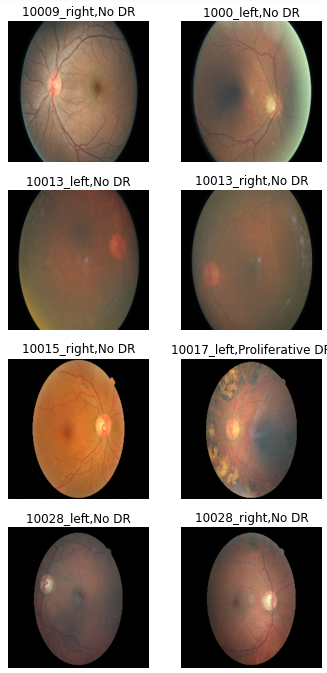
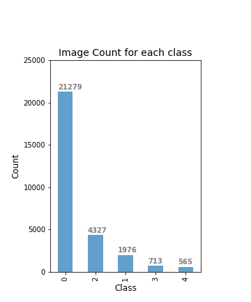

## Problem Statement

Diabetic Retinopathy (DR) is a complication resutling from diabetes that affects the eyes. It is caused by the damage of the blood vessels in the tissue at the back of the eye called retina. It can cause loss of vision or in severe cases can lead to blindness. Early detection of diabetic retinopathy is extremely crucial to prevent complete blindness. Currently DR is manually detected by trained clinians by examining the photographs of the retina and detecting the presence of lesions associated with the abnorminal blood vessels or haemorrage, that may represent as tiny red spots in the image. This manual detection is a very time consuming process. An automated system of DR detection from the images can help with early detection of this condition and help improve patients lives.

This project aims to create a model for automated detection (prediction) of the presence or absence of the condition by analyzing color fundus images, and if possible the severity of the condition. To address this task, different modeling techniques will be explored to find a model that can predict the presence of condition (Binary Classification) with highest possible accuracy; Recall and f1-score will be used as metrics to analyze the model performance.
We will also attempt to explore different modeling techniques to predict the severity of the condition (multi-class classification) and will use Recall and F1-score as metrics.  
  
References:  
1. https://www.mayoclinic.org/diseases-conditions/diabetic-retinopathy/symptoms-causes/syc-20371611  
2. R, Revathy. (2020). Diabetic Retinopathy Detection using Machine Learning. International Journal of Engineering Research and. V9. 10.17577/IJERTV9IS060170.   
  
## Data Collection

The data used in this project is a large set of retina images obtained from a Kaggle competition (https://www.kaggle.com/competitions/diabetic-retinopathy-detection/data). About 28,860 images were used for training the models and 3,822 images were used as test dataset. The data contains left and right field of images for patients and are labeled with a subject id and either left or right. The images are taken by different cameras, and under different imaging conditions, and are rated by trained clinicians for the presence of DR on a sclae 0-4 as following:  
0 - No DR  
1 - Mild  
2 - Moderate  
3 - Severe  
4 - Proliferative DR  
  
  
## EDA and Pre-processing

The data contains images with a variety of imaging conditions, some are overexposed, some are underexposed. The images also vary in zoom covering the area of interest and may also be flipped; some images are out of focus and are noisier than others which may make it hard to train the models but it also represent a real -life scenario where it is very pratical to encounter a variety of images/imaging conditions. Following figure shows representative set of images from the training set:  
  
Figure 1:  

  
On looking at the count of different classes of images, the data is severly imbalanced. A large portion of the data is for class 0 (21,279 images out of 28,860: 74%). The following histogram shows the counts for different classes:  
  
Figure 2:  

  
### Pre-processing
  
The images were resized to a dimension of 224x224 and saved on the disk to reduce the computational time during model fitting. The images were rescaled between 0 to 1 by dividing by 255 within CNN models.
  
For binary classification (detection of presence or absence of DR), the images of class 0 was taken as one class (absence of DR) and all the images of class 1 through 4 were relabeled as 1 (presence of DR). Following histogram shows the counts for both the classes, class 0 (no DR) is about 74% of the data.  
  
Figure 3:  

  
  

For multiclass classification, several different modeling techniques were tried including using the whole dataset, data augmentation within the model as well as using the pre-augmented data to overcome the imbalanced class problem. For data augmentation, different techniques like horizontal and vertical flipping, rotation, increasing/decreasing brightness etc. were used.    
To deal with imbalanced classes, following techniques were attempted:  
1. A subset of 4000 images of class 0 were taken, and all the images of rest of the classes (1 through 4) were taken. Data augmentation was implemented in the model as one of the first layers.   
2. A subset of 4000 images of class 0 were taken, and all the images of rest of the classes (1 through 4) were pre-augmented to bring the count to 4000 and saved on the disk. This dataset was then used to fit different models.  
3. A subset of 500 images of all the classes was used to fit the models. Images were converted from RGB to HSV in some of the CNN models in one of the first layers. This was combined with data augmentation in some models to see if it improves the performance.
    

## Modeling

### Binary Classification
The data for class 1 through 4 was relabeled as 1 and binry classification was attempted for no DR (class 0) and presence of DR (class 1 through 4).
Several modeling technoques were tried including:
1. CNN models with increasing depth and complexity (with and without Class weights and HSV conversion) 
2. Transfer Learning:
    a. MobileNet V2 (with and without Class weights)
    b. VGG16 (with and without Class Weights)
    c. InceptionResNetV2 (with and without ClassWeights, and hidden layer)
    

### Multiclass Classification
Several modeling techniques were tried for multiclass classification including:
1. Using whole dataset:
    a. CNN models (with and without Class Weights/batch included)
    b. Transfer Learning: 
        -MobileNet V2 trained on ImageNet (with Class Weights included)
        - VGG 16 (with and without Class Weights included)
2. Using smaller subset and data augmentation within model (refer to pre-processing 1):
    a. CNN models (with and without Class Weights included)
    
3. Using pre-augmented dataset (refer to pre-processing 2)
    a. CNN models with increasing depth/complexity and regularization
    
4. Using smaller balanced dataset (refer to pre-processing 3)
    a. CNN models with HSV conversion 

Sparse categorical accuracy, and F1score and recall for all classes were analyzed to determine the model performance. 
    
## Production Model 

### Binary Classification

### Multiclass Classification

## Next Steps

There are a lot of variables that can still be tweaked for each different modeling technique to improve the classification results. Some of these could be changing no. and design of Conv2D (filter) layers and dense layers in CNN models and fine tuning the transfer learning from pre-trained models. Also, some more data augmentation and pre-processing techniques can be tried to improve the performance.

